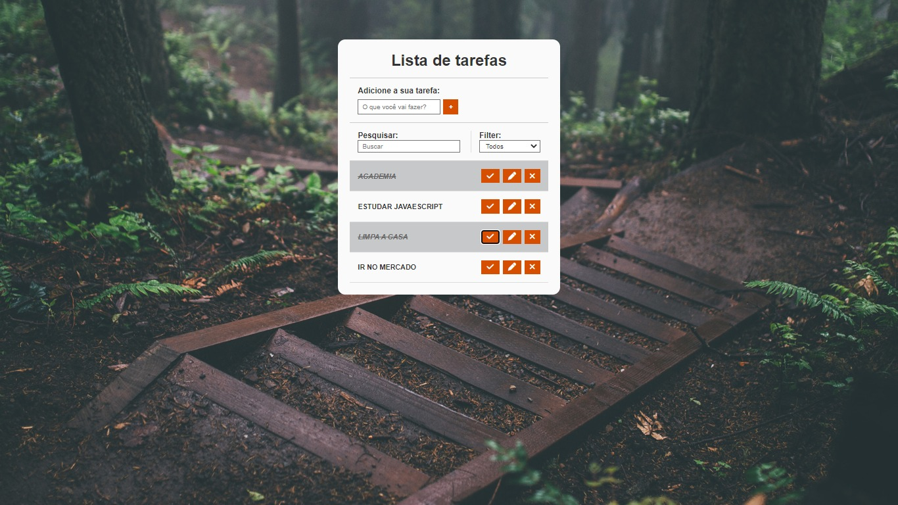

# Projeto<h1 align="center"> Lista de Tarefas </h1>

  

 

## 🚀 Tecnologias

Esse projeto foi desenvolvido com as seguintes tecnologias:

## 💻 Projeto

O projeto de lista de tarefa foi criado em uma video aula de javaScript

- [Acesse o projeto finalizado, online](https://renatodev23.github.io/lista-de-tarefas/)

---